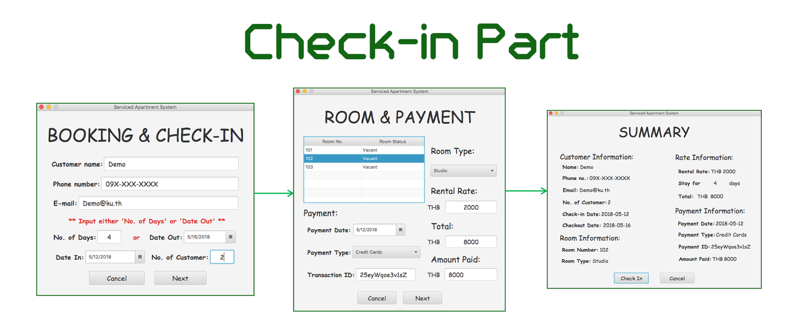
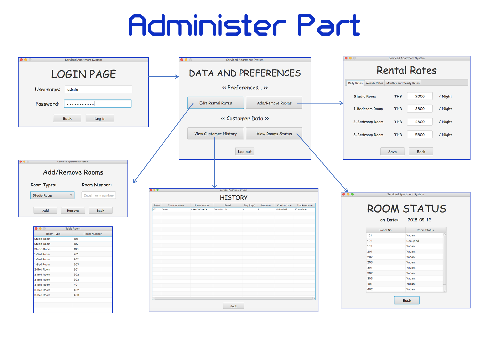

# Serviced Apartment System
**Table of contents**
- [About the Application](#about-the-application)
- [Technology and Knowledge](#technology-and-knowledge-that-we-used)
- [Installation](#installation)
- [Contributors](#contributors)
- [References](#references)

## About the Application
**Serviced Apartment System** application is an application that will be use by clerks and administer/owner of any serviced apartment with four types of room (Studio, 1-Bedroom, 2-Bedroom and 3-Bedroom). This application can be separate in three main parts which are check-in, checkout and administer part.

### Check-in Part

**In Check-in part**, the clerk will get all required information and put into the fields in first window then ask about room type and payment information from the customer. If press 'Check In' button in order's summary window, all information of an order will be save into the database. 

### Checkout Part

**In Checkout part**, the clerk will ask the customer for room number and the customer name and use to search for an order that match with the required information in the database. If it can be identical, the checkout will be successful and room status will be change into vacant state.

### Administer Part

**In Administer part**, user need to input the correct username and password before use this part. This part will let the administer(owner) be able to edit room rates, add/remove rooms, view room status in each day and able to view all order's history.

- Demo username and password

| **Username** |  **Password**  |
|:-------------|---------------:|
| admin        | 123456admin    |

### Packages
- checkin - Contains controller classes and user interface documents for check-in part.
- checkout - Contains controller class and user interface document for checkout part.
- data - Contains classes that related to received data and other useful classes.
- dataandpreferences - Contains controller classes and user interface documents for administer part.
- database - Contains class about database.
- home - Contains controller class and user interface document for home part.

## Technology and Knowledge that we used
### SQLite

- Docs: https://www.sqlite.org/docs.html
- Website: https://www.sqlite.org/index.html
- See also: https://docs.oracle.com/javase/tutorial/jdbc/basics/index.html

### ThreeTen-Extra

- Docs: http://www.threeten.org/threeten-extra/apidocs/index.html?org.threeten.extra-summary.html
- Website: http://www.threeten.org/threeten-extra/

### Patterns
- Singleton Pattern: Use for data manager which will do all activities that related with database.
- Observer Pattern: Use to show an update after the administer(owner) add/remove room in Administer part.

## Installation
To run this application, your computer need:
 - Java version 8 or newer
 - Serviced Apartment Application.jar file
 
### How to run
**Run a JAR file**
 1. Download a runnable JAR file named 'Serviced Apartment Application.jar' or 'Serviced Apartment System.zip' in a  Download folder above or click the link below.
 2. Runs 'Serviced Apartment Application.jar' file.
 
 - Link for JAR file: [Serviced Apartment Application.jar](https://github.com/NokKbl/Serviced-Apartment-System/blob/master/Download/Serviced%20Apartment%20Application.jar)
 - Link for ZIP file: [Serviced Apartment System.zip](https://github.com/NokKbl/Serviced-Apartment-System/blob/master/Download/Serviced%20Apartment%20System.zip)
 
**Compile by IDE(i.e. eclipse)**
 1. Download this project as ZIP then open in your IDE.
 2. Add the Referenced Libraries (can download from the links below or in 'source/Library JAR file' folder).

Download links:
- Download libraries in 'source/Library JAR file' folder [here](https://github.com/NokKbl/Serviced-Apartment-System/tree/master/source/Library%20JAR%20file)
- Download sqlite-jdbc Library [here](https://bitbucket.org/xerial/sqlite-jdbc/downloads/)
- Download threeten-extra Library [here](http://search.maven.org/#search%7Cgav%7C1%7Cg%3A%22org.threeten%22%20AND%20a%3A%22threeten-extra%22)

## Contributors
- [**Kunyaruk Katebunlu**](https://github.com/NokKbl) (ID: 6010545692)
- [**Thanaphon Keawjam**](https://github.com/ThanaphonKeawjam) (ID: 6010545781)
	
**Note:**
 This program is a final project of Object Oriented Programming II Course which created by students in Faculty of Software and Knowledge Engineering, Kasetsart University.

## References
- http://code.makery.ch/blog/javafx-dialogs-official/
- https://stackoverflow.com/
- http://www.sqlitetutorial.net/
- https://www.tutorialspoint.com/sqlite/sqlite_java.htm
- https://www.w3schools.com/sql/sql_where.asp
- https://www.youtube.com/channel/UCLEftf2Nu3I-sUBq9PbtQ9w
- Etc.
